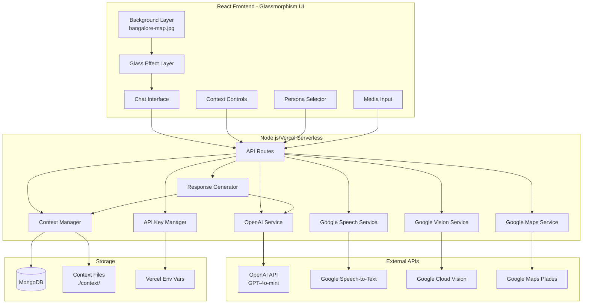
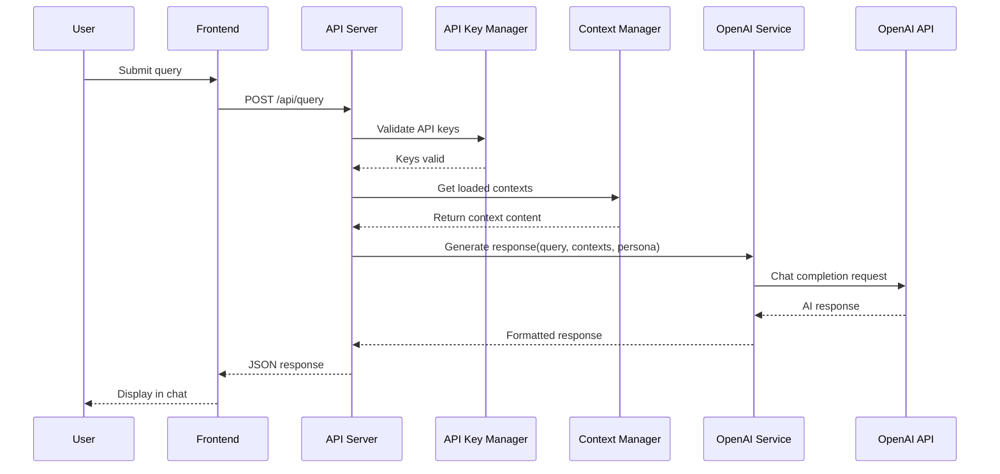

# Design Document: App Enhancement - Glassmorphism UI & API Integrations

## Overview

This design document covers the enhancement of the Bangalore Survival Assistant with a modern glassmorphism UI, integration of external AI APIs (OpenAI, Google Cloud), and secure deployment on Vercel. The enhancements transform the application from a context-file-based response system to a full AI-powered assistant while maintaining the existing context-switching functionality.

### Key Design Principles

1. **Glassmorphism Aesthetics**: Modern frosted glass UI with the Bangalore travel map background
2. **AI-Powered Responses**: OpenAI GPT-4o-mini for intelligent, context-aware responses
3. **Multi-Modal Input**: Google Cloud APIs for voice transcription and image processing
4. **Location Intelligence**: Google Maps Places API for real restaurant recommendations
5. **Security First**: All API keys server-side only, never exposed to clients
6. **Graceful Degradation**: Fallback to context-file responses when APIs unavailable

## Architecture



### Request Flow - AI-Powered Query



## UI Framework - Glassmorphism Design

### Glassmorphism CSS Variables

```css
:root {
  /* Glass effect base */
  --glass-bg: rgba(255, 255, 255, 0.15);
  --glass-bg-light: rgba(255, 255, 255, 0.25);
  --glass-bg-dark: rgba(0, 0, 0, 0.1);
  --glass-border: rgba(255, 255, 255, 0.3);
  --glass-shadow: 0 8px 32px rgba(0, 0, 0, 0.1);
  --glass-blur: blur(10px);
  --glass-blur-heavy: blur(20px);
  
  /* Text colors for contrast */
  --text-primary: #1a1a2e;
  --text-secondary: #4a4a6a;
  --text-light: #ffffff;
  --text-accent: #6366f1;
  
  /* Accent colors */
  --accent-primary: rgba(99, 102, 241, 0.8);
  --accent-success: rgba(34, 197, 94, 0.8);
  --accent-warning: rgba(234, 179, 8, 0.8);
  --accent-error: rgba(239, 68, 68, 0.8);
}
```

### Background Implementation

```typescript
// App.tsx - Background with glassmorphism overlay
<div className="app-container">
  {/* Fixed background image */}
  <div 
    className="app-background"
    style={{
      backgroundImage: `url('/assets/bangalore-map.jpg')`,
      backgroundSize: 'cover',
      backgroundPosition: 'center',
      backgroundAttachment: 'fixed',
      position: 'fixed',
      inset: 0,
      zIndex: -1
    }}
  />
  
  {/* Glass overlay for readability */}
  <div 
    className="app-overlay"
    style={{
      position: 'fixed',
      inset: 0,
      backgroundColor: 'rgba(255, 255, 255, 0.1)',
      backdropFilter: 'blur(2px)',
      zIndex: -1
    }}
  />
  
  {/* App content */}
  <div className="app-content">
    {/* Components */}
  </div>
</div>
```

### Glass Card Component

```css
.glass-card {
  background: var(--glass-bg);
  backdrop-filter: var(--glass-blur);
  -webkit-backdrop-filter: var(--glass-blur);
  border: 1px solid var(--glass-border);
  border-radius: 16px;
  box-shadow: var(--glass-shadow);
}

.glass-card-light {
  background: var(--glass-bg-light);
  backdrop-filter: var(--glass-blur-heavy);
}

.glass-card-dark {
  background: var(--glass-bg-dark);
  color: var(--text-light);
}
```

### Component Styling Hierarchy

| Component | Glass Level | Blur | Transparency | Purpose |
|-----------|-------------|------|--------------|---------|
| App Container | None | 2px overlay | 10% white | Subtle background softening |
| Chat Interface | Heavy | 20px | 25% white | Primary interaction area |
| Chat Messages (User) | Medium | 10px | 80% accent | User message distinction |
| Chat Messages (Assistant) | Light | 10px | 20% white | Assistant response |
| Control Panels | Medium | 15px | 20% white | Secondary controls |
| Buttons | Light | 5px | 30% accent | Interactive elements |
| Input Fields | Light | 10px | 15% white | Text input areas |

## Components and Interfaces

### API Key Manager

Centralized service for secure API key management.

```typescript
interface APIKeyConfig {
  openai: string | undefined;
  googleCloud: string | undefined;
  googleMaps: string | undefined;
}

interface APIKeyStatus {
  openai: boolean;
  googleSpeech: boolean;
  googleVision: boolean;
  googleMaps: boolean;
}

class APIKeyManager {
  private keys: APIKeyConfig;
  
  constructor() {
    this.keys = {
      openai: process.env.OPENAI_API_KEY,
      googleCloud: process.env.GOOGLE_CLOUD_API_KEY,
      googleMaps: process.env.GOOGLE_MAPS_API_KEY
    };
  }
  
  validateKeys(): APIKeyStatus;
  getOpenAIKey(): string | null;
  getGoogleCloudKey(): string | null;
  getGoogleMapsKey(): string | null;
  isFeatureEnabled(feature: 'openai' | 'speech' | 'vision' | 'maps'): boolean;
}
```

### OpenAI Service

Handles all OpenAI API interactions for chat responses.

```typescript
interface OpenAIRequest {
  query: string;
  persona: Persona;
  contextEnabled: boolean;
  loadedContexts: ContextContent[];
}

interface OpenAIResponse {
  response: string;
  model: string;
  tokensUsed: number;
}

class OpenAIService {
  private apiKey: string;
  private rateLimiter: RateLimiter;
  
  constructor(apiKeyManager: APIKeyManager);
  
  async generateResponse(request: OpenAIRequest): Promise<OpenAIResponse>;
  
  private buildSystemPrompt(
    persona: Persona, 
    contextEnabled: boolean, 
    contexts: ContextContent[]
  ): string;
  
  private buildUserPrompt(query: string): string;
  
  async generateImageInterpretation(
    extractedText: string,
    contexts: ContextContent[]
  ): Promise<string>;
}
```

**System Prompt Construction:**

```typescript
private buildSystemPrompt(
  persona: Persona,
  contextEnabled: boolean,
  contexts: ContextContent[]
): string {
  let prompt = `You are the Bangalore Survival Assistant, helping users navigate life in Bangalore.`;
  
  // Add persona instructions
  const personaInstructions = {
    'newbie': 'Use a friendly, reassuring tone with detailed explanations. The user is new to Bangalore.',
    'student': 'Use a casual, practical tone. Focus on budget-friendly options.',
    'it-professional': 'Be concise and efficient. Focus on time-saving tips.',
    'tourist': 'Be descriptive and culturally explanatory. Highlight must-see experiences.'
  };
  prompt += `\n\n${personaInstructions[persona]}`;
  
  // Add context if enabled
  if (contextEnabled && contexts.length > 0) {
    prompt += '\n\nUse the following local knowledge to inform your responses:\n';
    for (const ctx of contexts) {
      prompt += `\n--- ${ctx.domain.toUpperCase()} ---\n${ctx.content}\n`;
    }
  } else {
    prompt += '\n\nProvide general advice without Bangalore-specific details.';
  }
  
  return prompt;
}
```

### Google Speech Service

Handles voice transcription using Google Cloud Speech-to-Text.

```typescript
interface TranscriptionRequest {
  audioBuffer: Buffer;
  mimeType: string;
  languageCode?: string; // 'en-IN' or 'kn-IN' for Kannada
}

interface TranscriptionResponse {
  text: string;
  confidence: number;
  detectedLanguage: string;
}

class GoogleSpeechService {
  private apiKey: string;
  
  constructor(apiKeyManager: APIKeyManager);
  
  async transcribe(request: TranscriptionRequest): Promise<TranscriptionResponse>;
  
  getSupportedLanguages(): string[];
}
```

### Google Vision Service

Handles image OCR and language detection/translation.

```typescript
interface VisionRequest {
  imageBuffer: Buffer;
}

interface VisionResponse {
  extractedText: string;
  detectedLanguage: string;
  translatedText?: string; // If non-English
  confidence: number;
}

class GoogleVisionService {
  private apiKey: string;
  
  constructor(apiKeyManager: APIKeyManager);
  
  async extractAndTranslate(request: VisionRequest): Promise<VisionResponse>;
  
  private async detectText(imageBuffer: Buffer): Promise<string>;
  private async detectLanguage(text: string): Promise<string>;
  private async translateToEnglish(text: string, sourceLanguage: string): Promise<string>;
}
```

### Google Maps Service

Handles location-based restaurant recommendations.

```typescript
interface LocationQuery {
  lat: number;
  lng: number;
  foodType?: string; // e.g., 'dosa', 'biryani', 'coffee'
  radius?: number; // meters, default 1000
}

interface PlaceResult {
  name: string;
  address: string;
  rating: number;
  distance: number;
  priceLevel: number;
  types: string[];
  placeId: string;
}

interface EnhancedRecommendation {
  place: PlaceResult;
  contextualReasoning: string;
  culturalNote?: string;
}

class GoogleMapsService {
  private apiKey: string;
  private contextManager: ContextManager;
  
  constructor(apiKeyManager: APIKeyManager, contextManager: ContextManager);
  
  async getRecommendations(
    query: LocationQuery,
    foodContext: ContextContent | null
  ): Promise<EnhancedRecommendation[]>;
  
  private async searchNearbyPlaces(query: LocationQuery): Promise<PlaceResult[]>;
  
  private enhanceWithContext(
    places: PlaceResult[],
    foodContext: ContextContent | null,
    foodType?: string
  ): EnhancedRecommendation[];
}
```

### Rate Limiter

Prevents excessive API usage.

```typescript
interface RateLimitConfig {
  maxRequests: number;
  windowMs: number;
}

class RateLimiter {
  private requests: Map<string, number[]>;
  private config: RateLimitConfig;
  
  constructor(config: RateLimitConfig);
  
  isAllowed(identifier: string): boolean;
  getRemainingRequests(identifier: string): number;
  getResetTime(identifier: string): number;
}
```

## Data Models

### Environment Variables

```typescript
// Required environment variables for Vercel deployment
interface EnvironmentConfig {
  // Database
  MONGODB_URI: string;
  
  // OpenAI
  OPENAI_API_KEY: string;
  
  // Google Cloud (single key for Speech, Vision, Translate)
  GOOGLE_CLOUD_API_KEY: string;
  
  // Google Maps (separate key for Places API)
  GOOGLE_MAPS_API_KEY: string;
  
  // App config
  NODE_ENV: 'development' | 'production';
  ALLOWED_ORIGINS: string; // Comma-separated list
}
```

### .env.example Update

```bash
# Server
PORT=5000
NODE_ENV=development

# Database
MONGODB_URI=mongodb://localhost:27017/bangalore-assistant

# OpenAI
OPENAI_API_KEY=sk-your-openai-api-key

# Google Cloud (Speech-to-Text, Vision, Translate)
GOOGLE_CLOUD_API_KEY=your-google-cloud-api-key

# Google Maps (Places API)
GOOGLE_MAPS_API_KEY=your-google-maps-api-key

# Security
ALLOWED_ORIGINS=http://localhost:3000,https://your-app.vercel.app
```

### API Response Types

```typescript
interface QueryResponse {
  response: string;
  contextUsed: string[];
  persona: string;
  bangaloreContextActive: boolean;
  aiPowered: boolean;
  locationRecommendations?: EnhancedRecommendation[];
}

interface VoiceResponse {
  text: string;
  confidence: number;
  language: string;
}

interface ImageResponse {
  extractedText: string;
  translatedText?: string;
  interpretation: {
    localMeaning: string;
    culturalSignificance: string;
    practicalImplications: string;
  };
}

interface ErrorResponse {
  error: string;
  code: string;
  suggestion?: string;
}
```

## Correctness Properties

*A property is a characteristic or behavior that should hold true across all valid executions of a system - essentially, a formal statement about what the system should do. Properties serve as the bridge between human-readable specifications and machine-verifiable correctness guarantees.*

### Property 1: Glassmorphism Styling Consistency

*For any* UI component (chat interface, control panels, buttons), the glassmorphism styling SHALL be consistently applied with backdrop-filter blur, semi-transparent background, and border styling across all viewport sizes.

**Validates: Requirements 1.2, 1.4, 1.7**

### Property 2: API Key Security

*For any* client-side JavaScript bundle produced by the build process, the bundle SHALL NOT contain any API key values (OpenAI, Google Cloud, Google Maps) - all external API calls must originate from server-side code only.

**Validates: Requirements 2.7, 3.5, 4.6, 5.6, 6.2, 6.4**

### Property 3: Context-Aware Response Generation

*For any* query submitted with Bangalore context enabled, the OpenAI system prompt SHALL include the loaded context file contents; when context is disabled, the system prompt SHALL NOT include local context content.

**Validates: Requirements 2.1, 2.2, 2.3**

### Property 4: External API Error Handling

*For any* external API failure (OpenAI, Google Speech, Google Vision, Google Maps), the system SHALL return a user-friendly error message and fall back to appropriate alternative behavior (context-file responses, typing suggestion, or generic recommendations).

**Validates: Requirements 2.5, 3.4, 4.5, 5.5, 8.1, 8.2, 8.3, 8.4, 8.5**

### Property 5: Rate Limiting Enforcement

*For any* sequence of API requests exceeding the configured rate limit, the system SHALL reject additional requests with an appropriate error message until the rate limit window resets.

**Validates: Requirements 2.6**

### Property 6: Request Validation

*For any* API request with invalid or malicious input (missing required fields, invalid types, oversized payloads), the system SHALL reject the request with a 400 status code and descriptive error message.

**Validates: Requirements 7.5**

### Property 7: Location Recommendation Completeness

*For any* location-based food recommendation returned by the system, the response SHALL include restaurant name, distance from user, rating, and contextual reasoning explaining why the recommendation fits the user's query and location.

**Validates: Requirements 5.2, 5.3**

## Error Handling

### Frontend Error Handling

| Error Type | User Message | Action |
|------------|--------------|--------|
| OpenAI unavailable | "AI service temporarily unavailable. Using local knowledge." | Fall back to context-based response |
| Voice transcription failed | "Couldn't process voice. Please try typing your question." | Show text input |
| Image processing failed | "Couldn't read the image. Try describing what you see." | Show text input |
| Maps unavailable | "Location service unavailable. Showing general recommendations." | Use context-file recommendations |
| Rate limited | "Too many requests. Please wait a moment." | Show countdown timer |
| Network error | "Connection issue. Please check your internet." | Retry button |

### Backend Error Handling

| Error Type | HTTP Status | Response Code | Fallback |
|------------|-------------|---------------|----------|
| Missing API key | 503 | `SERVICE_UNAVAILABLE` | Disable feature, use fallback |
| OpenAI rate limit | 429 | `RATE_LIMITED` | Queue request or use context-only |
| OpenAI error | 502 | `AI_SERVICE_ERROR` | Context-file response |
| Google API error | 502 | `EXTERNAL_SERVICE_ERROR` | Feature-specific fallback |
| Invalid input | 400 | `INVALID_REQUEST` | Return validation errors |
| Unauthorized | 401 | `UNAUTHORIZED` | Prompt re-authentication |

### Graceful Degradation Matrix

| Service Down | Feature Impact | Fallback Behavior |
|--------------|----------------|-------------------|
| OpenAI | Chat responses | Use ResponseGenerator with context files only |
| Google Speech | Voice input | Disable voice button, prompt text input |
| Google Vision | Image upload | Disable image button, prompt text description |
| Google Maps | Location recommendations | Use LocationService with context files only |
| MongoDB | Session persistence | Use in-memory session, warn user |
| All external APIs | Full app | Fully functional with context-file responses |

