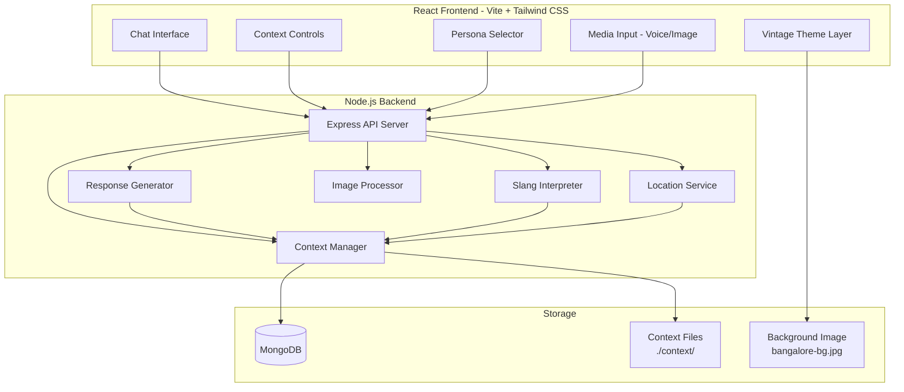
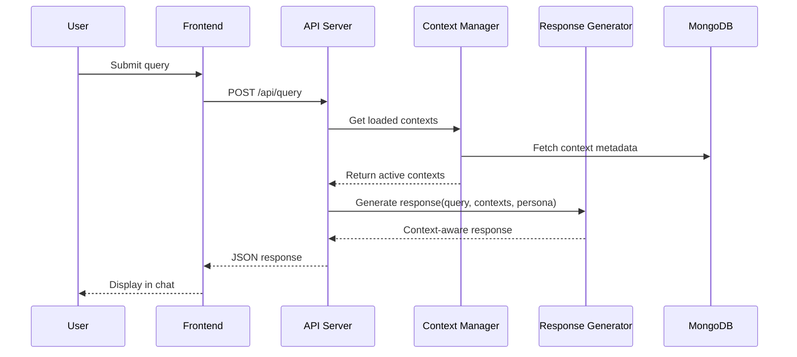

# Design Document: Bangalore Survival Assistant

## Overview

The Bangalore Survival Assistant is a context-aware AI web application that provides localized guidance for people visiting or living in Bangalore. The system's core innovation is its dynamic context-loading architecture - all local intelligence comes from markdown context files that can be loaded, unloaded, or switched at runtime, demonstrating clear behavioral changes.

The application follows a three-tier architecture:
- **Frontend**: React (Vite) SPA with chat interface, context controls, and media input handling
- **Backend**: Node.js/Express API server handling context management, AI response generation, and media processing
- **Database**: MongoDB for persisting context metadata and user session preferences

### Key Design Principles

1. **No Hardcoded Intelligence**: All city-specific knowledge lives in context files
2. **Observable Behavior Changes**: Same query produces different results based on context/persona
3. **Modular Context System**: Each domain (slang, food, traffic, etc.) is independently loadable
4. **Persona-Driven Adaptation**: Response tone and depth adapt to user archetype
5. **City-Agnostic Scalability**: The system is designed to work with any city's context files - changing the content of context files to a different city (e.g., Mumbai, Chennai) will automatically change the assistant's behavior accordingly without code modifications

## Architecture



### Request Flow



## UI Framework and Theming

### Tailwind CSS Integration

The frontend uses Tailwind CSS for styling, providing utility-first CSS with a custom theme inspired by a vintage travel/explorer aesthetic.

### Color Palette

Based on the vintage Bangalore travel map aesthetic:

| Color Name | Hex Code | Tailwind Class | Usage |
|------------|----------|----------------|-------|
| Parchment | `#F5E6D3` | `bg-parchment` | Primary background |
| Sepia | `#D4A574` | `bg-sepia` | Accent backgrounds, borders |
| Warm Brown | `#8B6914` | `text-warm-brown` | Primary text, headings |
| Olive Green | `#6B7B3C` | `bg-olive` | Success states, nature accents |
| Deep Brown | `#4A3728` | `bg-deep-brown` | Dark accents, buttons |
| Cream | `#FAF6F0` | `bg-cream` | Card backgrounds, inputs |
| Dusty Blue | `#5C6B7A` | `bg-dusty-blue` | Secondary accents |
| Rust | `#A0522D` | `text-rust` | Links, highlights |

### Tailwind Configuration

```javascript
// tailwind.config.js
module.exports = {
  content: ['./src/**/*.{js,ts,jsx,tsx}'],
  theme: {
    extend: {
      colors: {
        parchment: '#F5E6D3',
        sepia: '#D4A574',
        'warm-brown': '#8B6914',
        olive: '#6B7B3C',
        'deep-brown': '#4A3728',
        cream: '#FAF6F0',
        'dusty-blue': '#5C6B7A',
        rust: '#A0522D',
      },
      fontFamily: {
        serif: ['Playfair Display', 'Georgia', 'serif'],
        handwritten: ['Caveat', 'cursive'],
      },
      backgroundImage: {
        'bangalore-map': "url('/assets/bangalore-bg.jpg')",
      },
    },
  },
  plugins: [],
}
```

### Design System

| Element | Styling Approach |
|---------|------------------|
| Background | Full-screen vintage map image with subtle overlay |
| Cards | Semi-transparent cream (`bg-cream/90`) with sepia borders |
| Buttons | Deep brown with hover states, rounded corners |
| Input fields | Cream background with sepia border, warm-brown text |
| Chat bubbles | User: deep-brown bg, cream text; Assistant: cream bg, warm-brown text |
| Icons | Rust or olive green depending on context |
| Typography | Serif font for headings, handwritten style for accents |

### Background Image Implementation

```typescript
// App.tsx - Background wrapper
<div className="min-h-screen bg-bangalore-map bg-cover bg-center bg-fixed">
  <div className="min-h-screen bg-parchment/80 backdrop-blur-sm">
    {/* App content */}
  </div>
</div>
```

## Components and Interfaces

### Frontend Components

#### ChatInterface
Manages the conversational UI and message display.

```typescript
interface ChatMessage {
  id: string;
  role: 'user' | 'assistant';
  content: string;
  timestamp: Date;
  contextSnapshot: ContextState; // Captures context at time of message
}

interface ChatInterfaceProps {
  messages: ChatMessage[];
  onSendMessage: (content: string) => void;
  isLoading: boolean;
}
```

**Tailwind Styling:**
```tsx
// Chat container
<div className="flex flex-col h-full bg-cream/90 rounded-lg border-2 border-sepia shadow-lg">
  {/* Messages area */}
  <div className="flex-1 overflow-y-auto p-4 space-y-4">
    {/* User message */}
    <div className="flex justify-end">
      <div className="max-w-[70%] bg-deep-brown text-cream px-4 py-2 rounded-2xl rounded-br-sm">
        {message.content}
      </div>
    </div>
    {/* Assistant message */}
    <div className="flex justify-start">
      <div className="max-w-[70%] bg-parchment text-warm-brown px-4 py-2 rounded-2xl rounded-bl-sm border border-sepia">
        {message.content}
      </div>
    </div>
  </div>
  {/* Input area */}
  <div className="p-4 border-t border-sepia">
    <input className="w-full bg-cream border-2 border-sepia rounded-full px-4 py-2 text-warm-brown placeholder-sepia/60 focus:outline-none focus:border-rust" />
  </div>
</div>
```

#### ContextControls
Provides UI for toggling context files and viewing loaded status.

```typescript
interface ContextFile {
  id: string;
  name: string; // e.g., 'city.md', 'slang.md'
  domain: 'city' | 'slang' | 'food' | 'persona' | 'etiquette';
  isLoaded: boolean;
  lastModified: Date;
}

interface ContextControlsProps {
  contextFiles: ContextFile[];
  bangaloreContextEnabled: boolean;
  onToggleContext: (fileId: string) => void;
  onToggleBangaloreContext: (enabled: boolean) => void;
}
```

**Tailwind Styling:**
```tsx
// Context controls panel
<div className="bg-cream/95 rounded-lg border-2 border-sepia p-4 shadow-md">
  <h3 className="font-serif text-warm-brown text-lg mb-3">Context Files</h3>
  {/* Toggle switch */}
  <label className="flex items-center justify-between py-2 border-b border-sepia/30">
    <span className="text-deep-brown">{file.name}</span>
    <button className={`w-12 h-6 rounded-full transition-colors ${
      file.isLoaded ? 'bg-olive' : 'bg-sepia/40'
    }`}>
      <span className={`block w-5 h-5 bg-cream rounded-full shadow transform transition-transform ${
        file.isLoaded ? 'translate-x-6' : 'translate-x-1'
      }`} />
    </button>
  </label>
</div>
```

#### PersonaSelector
Allows user to switch between personas.

```typescript
type Persona = 'newbie' | 'student' | 'it-professional' | 'tourist';

interface PersonaSelectorProps {
  currentPersona: Persona;
  onSelectPersona: (persona: Persona) => void;
}
```

**Tailwind Styling:**
```tsx
// Persona selector
<div className="flex gap-2 p-2 bg-parchment/90 rounded-lg border border-sepia">
  {personas.map(persona => (
    <button
      key={persona}
      className={`px-4 py-2 rounded-full font-serif text-sm transition-all ${
        currentPersona === persona
          ? 'bg-deep-brown text-cream shadow-md'
          : 'bg-cream text-warm-brown hover:bg-sepia/20'
      }`}
    >
      {persona}
    </button>
  ))}
</div>
```

#### MediaInput
Handles voice recording and image upload.

```typescript
interface MediaInputProps {
  onVoiceInput: (audioBlob: Blob) => void;
  onImageUpload: (file: File) => void;
  isProcessing: boolean;
}
```

**Tailwind Styling:**
```tsx
// Media input buttons
<div className="flex gap-3">
  <button className="p-3 bg-olive text-cream rounded-full hover:bg-olive/80 transition-colors shadow-md">
    <MicrophoneIcon className="w-5 h-5" />
  </button>
  <button className="p-3 bg-rust text-cream rounded-full hover:bg-rust/80 transition-colors shadow-md">
    <CameraIcon className="w-5 h-5" />
  </button>
</div>
```

### Backend Components

#### ContextManager
Core component responsible for loading, caching, and providing context content.

```typescript
interface ContextContent {
  fileId: string;
  domain: string;
  content: string;
  parsedSections: Record<string, string>;
  loadedAt: Date;
}

interface ContextManager {
  loadContext(fileId: string): Promise<ContextContent>;
  unloadContext(fileId: string): Promise<void>;
  getLoadedContexts(): ContextContent[];
  isContextLoaded(fileId: string): boolean;
  getContextForDomain(domain: string): ContextContent | null;
}
```

#### ResponseGenerator
Generates context-aware responses based on loaded contexts and persona.

```typescript
interface QueryRequest {
  query: string;
  persona: Persona;
  location?: { lat: number; lng: number };
}

interface QueryResponse {
  response: string;
  contextUsed: string[]; // List of context files that influenced response
  persona: Persona;
  bangaloreContextActive: boolean;
}

interface ResponseGenerator {
  generateResponse(request: QueryRequest, contexts: ContextContent[]): Promise<QueryResponse>;
}
```

#### SlangInterpreter
Detects and explains slang phrases using slang.md context.

```typescript
interface SlangExplanation {
  phrase: string;
  meaning: string;
  tone: 'friendly' | 'rude' | 'sarcastic' | 'neutral' | 'affectionate';
  usage: {
    whoUses: string;
    whenAppropriate: string;
    whenInappropriate: string;
  };
}

interface SlangInterpreter {
  detectSlang(text: string): string[];
  explainSlang(phrase: string, slangContext: ContextContent): SlangExplanation | null;
}
```

#### ImageProcessor
Extracts text from images and provides local interpretation.

```typescript
interface ImageInterpretation {
  extractedText: string;
  localMeaning: string;
  culturalSignificance: string;
  associatedBehavior: string;
  practicalImplications: string;
}

interface ImageProcessor {
  extractText(imageBuffer: Buffer): Promise<string>;
  interpretImage(extractedText: string, contexts: ContextContent[]): Promise<ImageInterpretation>;
}
```

#### LocationService
Handles GPS-based location for food recommendations.

```typescript
interface FoodRecommendation {
  suggestion: string;
  reasoning: string; // Why this fits the location/context
  contextFactors: string[];
}

interface LocationService {
  getRecommendations(
    location: { lat: number; lng: number },
    foodContext: ContextContent,
    cityContext: ContextContent
  ): Promise<FoodRecommendation[]>;
}
```

### API Endpoints

| Method | Endpoint | Description |
|--------|----------|-------------|
| POST | /api/query | Submit user query, receive context-aware response |
| GET | /api/contexts | Get list of available context files and their status |
| POST | /api/contexts/:id/toggle | Toggle a specific context file on/off |
| POST | /api/persona | Set the active persona |
| POST | /api/voice | Process voice input, return transcribed text |
| POST | /api/image | Process image upload, return interpretation |
| GET | /api/session | Get current session state (persona, contexts) |

## Data Models

### MongoDB Collections

#### contexts
Stores metadata about context files.

```typescript
interface ContextDocument {
  _id: ObjectId;
  fileId: string;        // e.g., 'city', 'slang', 'food'
  fileName: string;      // e.g., 'city.md'
  domain: string;
  filePath: string;      // Path in ./kiro/
  isDefault: boolean;    // Load by default on startup
  lastModified: Date;
  checksum: string;      // For detecting file changes
}
```

#### sessions
Stores user session preferences.

```typescript
interface SessionDocument {
  _id: ObjectId;
  sessionId: string;
  persona: Persona;
  loadedContexts: string[];  // Array of fileIds
  bangaloreContextEnabled: boolean;
  createdAt: Date;
  updatedAt: Date;
}
```

#### queryLogs (optional, for analytics)
```typescript
interface QueryLogDocument {
  _id: ObjectId;
  sessionId: string;
  query: string;
  persona: Persona;
  contextsUsed: string[];
  bangaloreContextEnabled: boolean;
  timestamp: Date;
}
```

### Context File Format

Context files are markdown with structured sections. The format is city-agnostic - the same structure works for any city:

```markdown
# City Context: [City Name]

## Traffic Behavior
- Peak hours: [times]
- Local transport norms
...

## Local Customs
- Cultural practices
...

## Areas
### [Area Name]
- Area characteristics
...
```

The ContextManager parses these into searchable sections.

### City-Agnostic Design

The system is designed to be fully scalable to any city by simply replacing context file content:

| Design Decision | Rationale |
|-----------------|-----------|
| No hardcoded city names in code | Allows switching cities without code changes |
| Context files define all local intelligence | City knowledge is data, not logic |
| Generic domain structure (food, slang, traffic) | These domains apply universally across cities |
| Dynamic context loading | New cities can be added at runtime |

**Example**: To switch from Bangalore to Mumbai:
1. Replace content in city.md, slang.md, food.md, etc. with Mumbai-specific information
2. The assistant automatically provides Mumbai-specific guidance
3. No code changes required

**Validates: Requirement 2.6**

## Correctness Properties

*A property is a characteristic or behavior that should hold true across all valid executions of a system - essentially, a formal statement about what the system should do. Properties serve as the bridge between human-readable specifications and machine-verifiable correctness guarantees.*


### Property 1: Context ON/OFF Produces Different Responses

*For any* user query, when submitted with Bangalore context ON versus OFF, the responses SHALL be noticeably different - the context-ON response should contain Bangalore-specific references while the context-OFF response should be generic.

**Validates: Requirements 1.1, 1.2, 1.5**

### Property 2: Context Toggle Reflects Immediately

*For any* context toggle action (ON to OFF or OFF to ON), the very next query response SHALL reflect the new context state without requiring any restart or refresh.

**Validates: Requirements 1.3**

### Property 3: No Hardcoded Bangalore Logic

*For any* query submitted when all context files are unloaded, the response SHALL contain zero Bangalore-specific terms, phrases, or references - proving all local intelligence comes from context files.

**Validates: Requirements 1.4**

### Property 4: Context Content Inclusion/Exclusion

*For any* context file, when loaded, its specific content SHALL appear in relevant responses; when unloaded, its specific content SHALL NOT appear in responses.

**Validates: Requirements 2.3, 2.4**

### Property 5: Missing Context Fallback

*For any* domain query (slang, food, traffic, etc.) when the corresponding context file is missing, the system SHALL return a generic response without local specifics.

**Validates: Requirements 2.5, 4.5, 5.6, 6.5**

### Property 6: Persona Switch Reflects Immediately

*For any* persona switch action, the very next query response SHALL reflect the new persona's characteristics without requiring restart.

**Validates: Requirements 3.6**

### Property 7: Different Personas Produce Different Responses

*For any* user query, when submitted with different personas selected, the responses SHALL differ in tone, depth, or style appropriate to each persona.

**Validates: Requirements 3.8**

### Property 8: No Hardcoded Persona Behavior

*For any* query submitted when persona.md is unloaded, the response SHALL not exhibit persona-specific tone variations - proving persona behavior comes from the context file.

**Validates: Requirements 3.7**

### Property 9: Slang Explanation Completeness

*For any* detected slang phrase with slang.md loaded, the explanation SHALL include: meaning, tone classification, and social usage context (who uses it, when appropriate, when inappropriate).

**Validates: Requirements 4.2, 4.3, 4.4**

### Property 10: Image Text Extraction

*For any* uploaded image containing visible text, the system SHALL extract and return the text content.

**Validates: Requirements 5.1**

### Property 11: Image Interpretation Completeness

*For any* image interpretation with relevant context files loaded, the response SHALL include: local meaning (beyond literal), cultural significance, associated behavior, and practical implications.

**Validates: Requirements 5.2, 5.3, 5.4, 5.5**

### Property 12: Location-Based Recommendations with Reasoning

*For any* food recommendation request with GPS location and food/city context loaded, the recommendations SHALL include situational reasoning explaining why the suggestion fits the location and context.

**Validates: Requirements 6.1, 6.2, 6.3**

### Property 13: No Hardcoded Restaurant Data

*For any* food recommendation when food.md is unloaded, the response SHALL contain zero specific restaurant names or addresses - proving all location data comes from context files.

**Validates: Requirements 6.4**

### Property 14: Chat History Maintained

*For any* sequence of messages within a session, all previous messages SHALL remain visible and accessible in the chat history.

**Validates: Requirements 7.3**

### Property 15: API Error Responses

*For any* failed API request (invalid input, server error, etc.), the response SHALL include an appropriate HTTP status code (4xx or 5xx) and a descriptive error message.

**Validates: Requirements 10.6**

### Property 16: Session Preferences Persistence

*For any* session, the selected persona and context settings SHALL persist across multiple requests within that session.

**Validates: Requirements 11.2**

### Property 17: City-Agnostic Scalability

*For any* set of context files with content changed to a different city, the system SHALL produce responses reflecting the new city's information without requiring any code changes - proving the system is city-agnostic and scalable.

**Validates: Requirements 2.6**

## Error Handling

### Frontend Error Handling

| Error Type | Handling Strategy |
|------------|-------------------|
| API timeout | Display "Connection slow, retrying..." with retry button |
| API failure | Display error message, allow retry |
| Voice input failure | Show "Could not process voice, please try again or type" |
| Image upload failure | Show "Image upload failed" with file size/format hints |
| Invalid file type | Prevent upload, show supported formats |

### Backend Error Handling

| Error Type | HTTP Status | Response |
|------------|-------------|----------|
| Invalid query | 400 | `{ error: "Invalid query format", details: [...] }` |
| Context file not found | 404 | `{ error: "Context file not found", fileId: "..." }` |
| MongoDB unavailable | 503 | `{ error: "Database temporarily unavailable" }` |
| Image processing failure | 422 | `{ error: "Could not process image", reason: "..." }` |
| Voice transcription failure | 422 | `{ error: "Could not transcribe audio", reason: "..." }` |
| Internal server error | 500 | `{ error: "Internal server error", requestId: "..." }` |

### Context File Error Handling

- **File missing**: Log warning, exclude from available contexts, continue with others
- **File malformed**: Log error with parse details, skip file, notify admin
- **File permissions**: Log error, attempt read with elevated permissions or skip

## Testing Strategy

### Unit Tests

Unit tests will verify specific examples and edge cases:

- Context file parsing (valid markdown, malformed markdown, empty files)
- Slang detection (known phrases, partial matches, no matches)
- API endpoint validation (valid requests, missing fields, invalid types)
- Session management (create, update, expire)
- Error response formatting

### Property-Based Tests

Property-based tests will verify universal properties using fast-check library:

- **Minimum 100 iterations** per property test
- Each test tagged with: `Feature: local-culture-guide, Property N: [property text]`
- Focus on core logic: context switching, persona adaptation, response generation

### Integration Tests

- Full request flow: query → context loading → response generation
- Context toggle → immediate response change
- Persona switch → response adaptation
- Image upload → text extraction → interpretation

### Test Configuration

```javascript
// fast-check configuration
fc.configureGlobal({
  numRuns: 100,
  verbose: true
});
```

### Test File Structure

```
tests/
├── unit/
│   ├── contextManager.test.ts
│   ├── slangInterpreter.test.ts
│   ├── responseGenerator.test.ts
│   └── api.test.ts
├── property/
│   ├── contextSwitching.property.test.ts
│   ├── personaAdaptation.property.test.ts
│   └── responseGeneration.property.test.ts
└── integration/
    ├── queryFlow.test.ts
    └── mediaProcessing.test.ts
```
